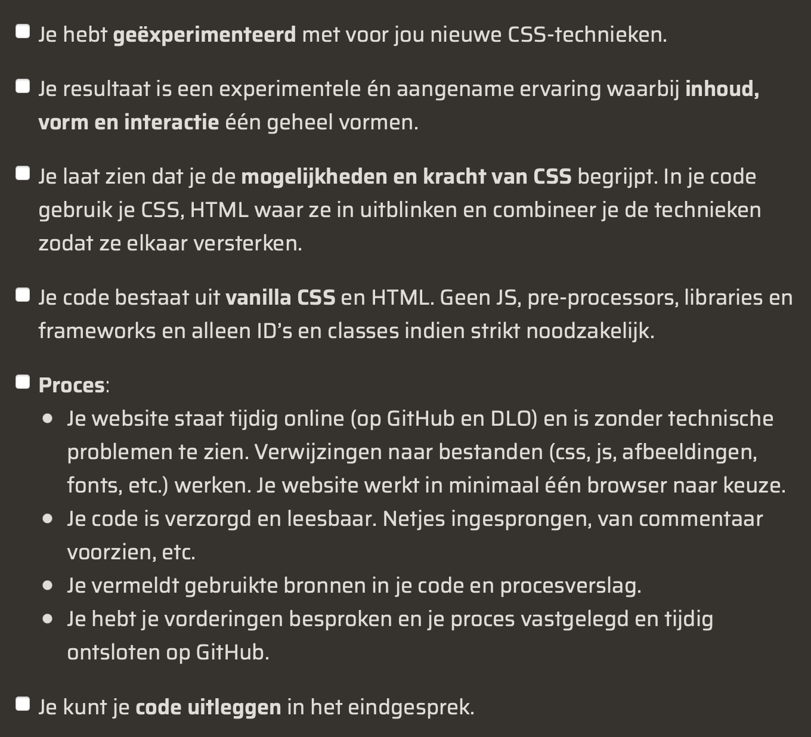

# CSS to the rescue

Welkom bij mijn project van de minor Webdesign and development. Het doel van dit vak is dat wij een interactieve webpagina maken met alleen CSS. Javascript is niet toegestaan. Ik heb ervoor gekozen om een vuurwerk show te maken

## Resultaat

Hier kan je de pagina bekijken [Vuurwerkshow](https://fabian-vis.github.io/vuurwerk-je-/ "Vuurwerkshow")

Mijn procesverslag is hier te bekijken[procesverslag](https://github.com/fabian-vis/vuurwerk-je-/wiki "procesverslag")

## Leerproces

Het werken met animaties is voor mij nieuw. Ik hoop daarom tijdens dit vak ook veel te kunnen experimenteren met animaties en alles wat daarbij komt kijken zodat ik dit later hopelijk kan gebruiken bij andere projecten. Verder probeer ik zo goed mogelijk gebruik te maken van selectoren en ga ik (proberen) absoluut geen classes en ids gebruiken.

## Beoordelingscriteria

## To do

| To do               | Done? |
| :------------------ | :---- |
| Vuurwerk animatie   | ✅    |
| Checkbox css only   | ✅    |
| Light and dark mode | ✅    |
| Details buttons     | ✅    |

## Wat zou ik nog willen toevoegen?

- Als ik nog tijd over had zou ik van de atoombom button maken dat je eerst moet klikken op de kap om hem open te maken en dan nog een keer klikken om de animatie te starten. Nu is het 1 voelende beweging.
- Ik vond het erg leuk om de minecraft lever na te maken. Als ik meer tijd had zou ik proberen om in 2d iets anders van minecraft na te willen maken. Ik had bijvoorbeeld een boomstam gezien. Het leek me dan erg cool om deze exact na te maken met allemaal divjes. Helaas had ik hier geen tijd meer voor.

## License

MIT License.
